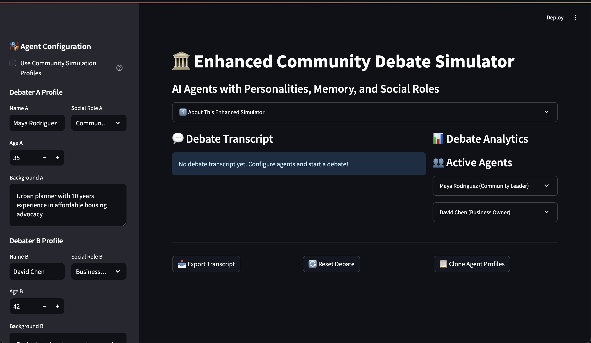

# 🏛️ Enhanced Community Debate Simulator



## Overview

The Enhanced Community Debate Simulator is an AI-powered web application that simulates debates between agents with distinct personalities, memories, and social roles. Built with Streamlit, LangGraph, and OpenAI, it allows users to:

- Configure agent profiles (name, age, social role, background, personality traits)
- Set debate topics and number of rounds
- Watch AI agents debate in real time
- Analyze debate transcripts and receive automated, detailed judge evaluations
- Export or reset debate transcripts

## Features

- **Agent Configuration:**
  - Customize each debater's name, age, social role, background, and personality
  - Use prebuilt community simulation profiles or create your own
- **Debate Simulation:**
  - AI agents generate arguments, rebuttals, and questions based on their profiles
  - Memory system for context-aware responses
- **Debate Analytics:**
  - Automated judge verdict with strengths, weaknesses, and quality score
  - Metrics for rounds, messages, and agent performance
- **Export & Clone:**
  - Export debate transcripts
  - Clone agent profiles for reuse

## Quickstart

1. **Clone the repository:**
   ```bash
   git clone <your-repo-url>
   cd convince-me
   ```
2. **Install dependencies:**
   ```bash
   pip install -r requirements.txt
   ```
3. **Set up OpenAI API key:**
   - Create a `.streamlit/secrets.toml` file:
     ```toml
     OPENAI_API_KEY = "sk-..."
     ```
4. **Run the app:**
   ```bash
   streamlit run app.py
   ```
5. **Open your browser:**
   - Go to `http://localhost:8501` to use the simulator.


## License

MIT License

---

*Built with Streamlit, LangGraph, and OpenAI. For research, education, and community engagement.*
